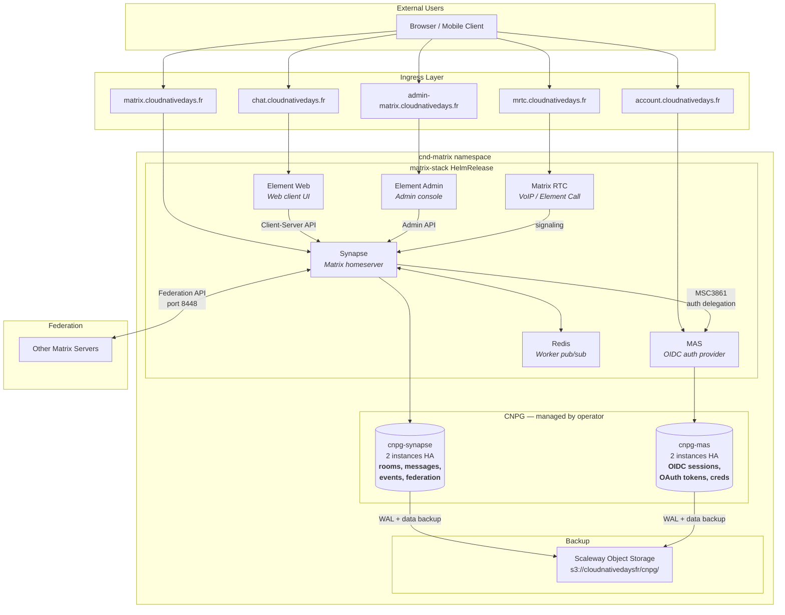

# Matrix (Element Server Suite) — Architecture

## Overview

Cloud Native Days France deploys [Matrix](https://matrix.org/) as a team communication platform using the [Element Server Suite (ESS) Community Helm chart](https://github.com/element-hq/ess-helm) (`matrix-stack`). This chart deploys a complete Matrix stack on Kubernetes, managed by Flux CD GitOps.

## Components

| Component | Subdomain | Role |
|-----------|-----------|------|
| **Synapse** | `matrix.cloudnativedays.fr` | Matrix homeserver — rooms, messages, federation |
| **Element Web** | `chat.cloudnativedays.fr` | Web client (static SPA) |
| **MAS** | `account.cloudnativedays.fr` | OIDC authentication provider |
| **Element Admin** | `admin-matrix.cloudnativedays.fr` | Administration console |
| **Matrix RTC** | `mrtc.cloudnativedays.fr` | VoIP / Element Call signaling |

## Architecture Diagram



## Why two PostgreSQL databases?

MAS (Matrix Authentication Service) is a **standalone OIDC provider** that replaced Synapse's built-in authentication. It communicates with Synapse via API ([MSC3861](https://github.com/matrix-org/matrix-spec-proposals/pull/3861)), not shared database tables. This clean separation requires each component to own its data independently.

| Database | Component | Stores |
|----------|-----------|--------|
| `cnpg-synapse` | Synapse | Rooms, messages, events, room state, user profiles, federation data |
| `cnpg-mas` | MAS | OIDC sessions, OAuth2 tokens, authentication credentials, user-device mappings |

Both CNPG clusters run **2 instances** (primary + replica) for high availability, with daily backups and continuous WAL archiving to Scaleway Object Storage.

## Component interactions

1. **Element Web** is a static SPA that talks to Synapse via the [Client-Server API](https://spec.matrix.org/latest/client-server-api/)
2. **Synapse** handles rooms, messages, and federation. It delegates all authentication to MAS via MSC3861 (OIDC-native auth delegation)
3. **MAS** handles login flows, token issuance, and session management
4. **Element Admin** calls Synapse's [Admin API](https://element-hq.github.io/synapse/latest/usage/administration/admin_api/index.html)
5. **Matrix RTC** handles VoIP signaling through Synapse
6. **Redis** is internal only — pub/sub between Synapse workers when running in multi-worker mode (bundled by the chart, not a persistent data store)

## GitOps structure

```
matrix/
  kustomization.yaml              # Kustomize resource list
  helmrelease.yaml                # ESS matrix-stack HelmRelease
  cnpg-cluster-synapse.yaml       # CNPG cluster for Synapse
  cnpg-cluster-mas.yaml           # CNPG cluster for MAS
  cnpg-scheduled-backup-synapse.yaml
  cnpg-scheduled-backup-mas.yaml
  synapse-cnpg-secret.yaml        # SealedSecret — DB credentials
  mas-cnpg-secret.yaml            # SealedSecret — DB credentials
  cnd-france-scw-secret.yaml      # SealedSecret — Scaleway backup credentials
flux/sources/
  helmrepo-ess.yaml               # OCI HelmRepository (ghcr.io/element-hq/ess-helm)
clusters/k8s-cndfrance-prod/
  matrix.yaml                     # Flux Kustomization
```

## Post-deployment steps

1. **DNS**: create A/CNAME records for `matrix`, `chat`, `account`, `admin-matrix`, `mrtc` under `cloudnativedays.fr`
2. **SealedSecrets**: run `kubeseal` to generate encrypted values for the 3 secret files
3. **First admin user**:
   ```bash
   kubectl exec -n cnd-matrix -it deploy/matrix-stack-matrix-authentication-service \
     -- mas-cli manage register-user
   ```
4. **Federation test**: verify at https://federationtester.matrix.org/ with `matrix.cloudnativedays.fr`

## References

- [ESS Helm chart](https://github.com/element-hq/ess-helm)
- [ESS architecture docs](https://github.com/element-hq/ess-helm/blob/main/docs/architecture.md)
- [MAS architecture](https://matrix-org.github.io/matrix-authentication-service/development/architecture.html)
- [Element MAS configuration](https://docs.element.io/latest/element-server-suite-pro/configuring-components/configuring-matrix-authentication-service/)
